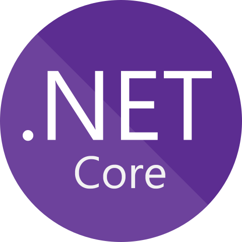

<!-- start document -->
<div id="start"></div>

<!-- project overview -->
<br />
<div align="center">
  <!-- project image -->
  <a href="https://github.com/jath-git/Space-Invaders">
    
  </a>

  <h3>Space Invaders</h3>
  <!-- languages used in project -->
  <div>
    
    
  </div>
  <!-- project description -->
    <p>
   A space invaders game. First ever project! Implemented multiple classes, form designs.
    <br />
    </p>
</div>

## Getting Started
* [Visual Studio for C#](https://visualstudio.microsoft.com/vs/)

## Instructions
* Run program
```console
open solution editor
```
```console
click run program or play button
```
